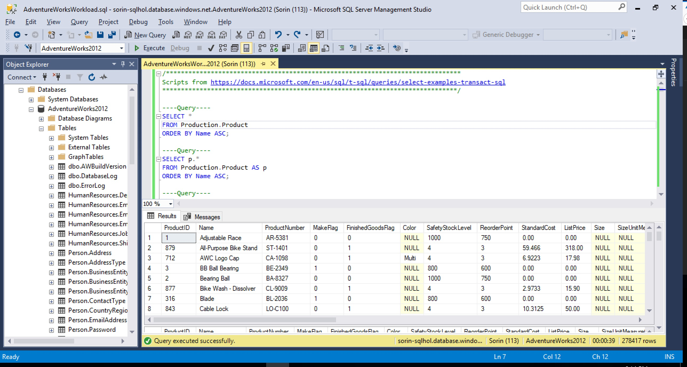

# Migrate Your On-premises Database to Azure 

## Assess your on-premises database
Before you can migrate data from an on-premises SQL Server instance to Azure SQL Database, you need to assess the SQL Server database for any blocking issues that might prevent migration. 

[Data Migration Assistant (DMA)](https://docs.microsoft.com/en-us/sql/dma/dma-overview) enables you to upgrade to a modern data platform by detecting compatibility issues that can impact database functionality on your new version of SQL Server. It recommends performance and reliability improvements for your target environment. It allows you to not only move your schema and data, but also uncontained objects from your source server to your target server.

> [!NOTE]
> If you don't have DMA installed, [click here](https://www.microsoft.com/en-us/download/details.aspx?id=53595) to download and install it.

1.	In the Data Migration Assistant, select the New (+) icon, and then select the **Assessment**  project type.
2.	Specify a project name, in the **Source server type** text box, select **SQL Server**, and then in the **Target server type** text box, select **Azure SQL Database**.
3.	Select **Create** to create the project.

    When you are assessing the source SQL Server database migrating to Azure SQL Database, you can choose one or both of the following assessment report types:
    - Check database compatibility
    - Check feature parity

    Both report types are selected by default.
4.	In the Data Migration Assistant, on the **Options** screen, select **Next**.
5.  On the **Select sources** screen, in the **Connect to a server** dialog box, provide the connection details to your SQL Server, and then select **Connect**.
6.	In the **Add sources** dialog box, select **AdventureWorks2012**, select **Add**, and then select **Start Assessment**.

    When the assessment is complete, the results display as shown in the following graphic:

    

    For Azure SQL Database, the assessments identify migration blocking issues and feature parity issues.

7.	Review the assessment results for migration blocking issues and feature parity issues by selecting the specific options.
    - The **SQL Server feature parity** category provides a comprehensive set of recommendations, alternative approaches available in Azure, and mitigating steps to help you plan the effort into your migration projects.
    - The **Compatibility issues** category identifies partially supported or unsupported features that reflect compatibility issues that might block migrating on-premises SQL Server database(s) to Azure SQL Database. Recommendations are also provided to help you address those issues.

## Migrate the sample schema
After you are comfortable with the assessment and satisfied that the selected database is a good candidate for migration to Azure SQL Database, use the Data Migration Assistant to migrate the schema to Azure SQL Database.

> [!NOTE]
> Before you create a migration project in Data Migration Assistant, be sure that you have already provisioned an Azure SQL database. For purposes of this tutorial, the name of the Azure SQL Database is assumed to be **AdventureWorksAzure**, but you can name it differently if you wish.

To migrate the **AdventureWorks2012** schema to Azure SQL Database, perform the following steps:

1.	In the Data Migration Assistant, select the New (+) icon, and then under **Project type**, select **Migration**.
3.	Specify a project name, in the **Source server type** text box, select **SQL Server**, and then in the **Target server type** text box, select **Azure SQL Database**.
4.	Under **Migration Scope**, select **Schema only**.

    After performing the previous steps, the Data Migration Assistant interface should appear as shown in the following graphic:
    
    

5.	Select **Create** to create the project.
6.	In the Data Migration Assistant, specify the source connection details for your SQL Server, select **Connect**, and then select the **AdventureWorks2012** database.

    
7.	Select **Next**, under **Connect to target server**, specify the target connection details for the Azure SQL database, select **Connect**, and then select the **AdventureWorksAzure** database you had pre-provisioned in Azure SQL database.

    
8.	Select **Next** to advance to the **Select objects** screen, on which you can specify the schema objects in the **AdventureWorks2012** database that need to be deployed to Azure SQL Database.

    By default, all objects are selected.

    
9.	Select **Generate SQL script** to create the SQL scripts, and then review the scripts for any errors.

    
10.	Select **Deploy schema** to deploy the schema to Azure SQL Database, and then after the schema is deployed, check the target server for any anomalies.

    

## Register the Microsoft.DataMigration resource provider
1. Log in to the Azure portal, select **All services**, and then select **Subscriptions**.
 
   
       
2. Select the subscription in which you want to create the instance of the Azure Database Migration Service, and then select **Resource providers**.
 
        
3.  Search for migration, and then to the right of **Microsoft.DataMigration**, select **Register**.
 
        

## Create an instance
1.	In the Azure portal, select **+ Create a resource**, search for Azure Database Migration Service, and then select **Azure Database Migration Service** from the drop-down list.

    
2.  On the **Azure Database Migration Service (preview)** screen, select **Create**.
 
    
  
3.	On the **Database Migration Service** screen, specify a name for the service, the subscription, a virtual network, and the pricing tier.

    For more information on costs and pricing tiers, see the [pricing page](https://aka.ms/dms-pricing).

     

4.	Select **Create** to create the service.

## Create a migration project
After the service is created, locate it within the Azure portal, and then create a migration project.
1. In the Azure portal, select **All services**, search for Azure Database Migration Service, and then select **Azure Database Migration Services**.
 
      
2. On the **Azure Database Migration Services** screen, search for the name of the Azure DMS instance that you created, and then select the instance.
 
     
 
3. Select **+ New Migration Project**.
4. On the **New migration project** screen, specify a name for the project, in the **Source server type** text box, select **SQL Server**, and then in the **Target server type** text box, select **Azure SQL Database**.

    

5.	Select **Create** to create the project.

## Specify source details
1. On the **Source details** screen, specify the connection details for the source SQL Server.

    

2. Select **Save**, and then select the **AdventureWorks2012** database for migration.

    

## Specify target details
1. Select **Save**, and then on the **Target details** screen, specify the connection details for the target, which is the pre-provisioned Azure SQL Database to which the **AdventureWorks2012** schema was deployed by using the Data Migration Assistant.

    

2. Select **Save** to save the project.
3. On the **Migration summary** screen, review and verify the details associated with the migration project.

    

4. Select **Save**.

## Run the migration
1.	Select the recently saved project, select **+ New Activity**, and then select **Run Data Migration**.

    

2.	When prompted, enter the credentials for the source and the target servers, and then select **Save**.
3.	On the **Map to target databases** screen, map the source and the target database for migration.

    If the target database contains the same database name as the source database, Azure DMS selects the target database by default.

    

4. Select **Save**, on the **Select tables** screen, expand the table listing and review the list of affected fields.

    

5.	Select **Save**, on the **Migration summary** screen, in the **Activity name** text box, specify a name for the migration activity.

    On this screen, you can also expand the **Choose validation option** screen, which you can use to specify to validate the migrated database for:
    - Schema
    - Data Consistency
    - Query Correctness and Performance

    

6.	Select **Save**, review the summary to ensure that the source and target details match what you previously specified.

    

7.	Select **Run migration** to start the migration activity, and then select **Refresh** to review the current status.

    

## Monitor the migration
1. Select the migration activity to review the status of the activity.
2. Verify the target Azure SQL database after the migration is complete.

    

## Generate a sample workload

In order to better understand some of Azure SQL Database's features, we're going to generate some queries on the newly migrated database.

1. Connect to the database using SQL Server Management Studio.

2. Save the [AdventureWorksWorkload.sql](./scripts/AdventureWorksWorkload.sql) file locally, and open it in Management Studio, using **File** / **Open** / **File...**

3. Execute the file by pressing **F5**.

    

4. You can optionally run the file multiple times to generate a longer workload.
